<h1 align="center">Hi 👋, I'm Jad Ayoubi</h1>

  

  
  
  
  

---

### 🧑‍💻 About me

I'm a full-stack developer with three years of experience shipping production web and mobile applications, from database schema to deployment. Front ends in **React, Next.js and React Native**; APIs in **Node.js and Express** with queue-based background jobs; data on **PostgreSQL, MySQL and MongoDB**.

I like owning a product end to end: shaping the schema, designing the API, building the UI, then keeping it healthy once it's live. Most of my client work ships with its own CMS and admin dashboard, so the people running the business never need a developer to change a page.

Along the way I've led an intern team and taught university labs, which keeps me honest about writing code other people can read.

---

### 💼 Currently

- 🏢 **Full Stack Web & App Developer @ [Pixel38](https://www.linkedin.com/company/pixel38/)** *(Jan 2026 to Present)*: React and Next.js web apps, React Native mobile apps, Node/Express APIs with BullMQ job queues, and the relational data layer on MySQL and PostgreSQL
- 📱 **Building a React Native home-services marketplace app**: live tracking, bidding, real-time chat, Arabic RTL
- 🌐 **Client platforms shipped end to end**, from marketing sites to storefronts with their own admin dashboards (see [Featured work](#%EF%B8%8F-featured-work))

### 🕰️ Previously

- 🚚 **Full Stack Web & App Developer @ [SecuFleet](https://www.secu-fleet.com/)** *(Oct 2023 to Dec 2025)*: company and client websites and apps in React, React Native, Express and MongoDB; led the intern team; partnered with marketing and UI/UX on product design
- 🎓 **Lab Instructor @ [Beirut Arab University](https://www.bau.edu.lb/)** *(2023 to 2025)*: hands-on labs for Data Structures, Databases and Web Development, with weekly assessments

---

### 🚀 Notable work

- 💳 **Nevada**: business-management platform pairing a public site with a feature-rich admin dashboard; JWT auth, REST API and **Stripe payments** on MongoDB, deployed to Vercel
- 🧴 **Prestige Mist**: commercial web app for a Canadian fragrance retailer with **role-based admin**, content publishing workflows, Cloudinary media and database-driven page management, 90+ products
- 🎯 **Tareekey**: **AI-powered** career and education guidance platform in Next.js and TypeScript, with real-time features over Socket.IO
- 🚚 **SecuFleet**: fleet-management platform with GPS tracking, route planning, driver behaviour and analytics; my largest codebase at **450+ commits**
- 👥 **Led the intern team** at SecuFleet, scoping tasks and mentoring on full-stack development
- 🎓 **Taught three university courses' labs**: Data Structures, Databases and Web Development
- 🌍 **31 live deployments** across six custom domains, with storefronts in English, Arabic and Spanish

---

### 📊 By the numbers

  <picture>
    <source media="(prefers-color-scheme: dark)" srcset="assets/stats-dark.svg">
    
  </picture>

  <em>Most of my work lives in private client repositories, so the public contribution graph tells a fraction of the story. 
  This banner is rendered straight from the GitHub API by <a href="scripts/generate_stats.py">a small script</a> and refreshed weekly by a GitHub Action.</em>

---

### 🧰 Tech stack

**Frontend**  

**Mobile**  

**Backend**  

**Databases**  

**Platforms & DevOps**  

**Tools**  

---

### 🏗️ Featured work

Everything below is live and in use by real businesses.

| Project | What it is | Built with | Live |
| --- | --- | --- | --- |
| **Tareekey** | AI-powered career &amp; education guidance platform with real-time features | Next.js · TypeScript · Tailwind · Socket.IO · Framer Motion | [tareekey.com](https://www.tareekey.com/) |
| **SecuFleet** | Fleet management: GPS tracking, route planning, driver behaviour, asset tracking and analytics | Node · Express · MongoDB · Tailwind · JWT | [secu-fleet.com](https://www.secu-fleet.com/) |
| **Prestige Mist** | Luxury fragrance store for the Canadian market, 90+ products, role-based admin and CMS | JavaScript · Node · MongoDB · Cloudinary | [prestigemist.ca](https://www.prestigemist.ca/) |
| **Nevada** | Business-management platform: public site plus admin dashboard with Stripe payments | React · Vite · Node · MongoDB · JWT · Stripe | [nevada-client](https://nevada-client.vercel.app/) |
| **BeiruGate** | Logistics, freight and customs-clearance company site with a separate admin dashboard | React · Vite · Node · MongoDB | [beirugate.online](https://www.beirugate.online/) |
| **Dough &amp; Co** | Bakery brand site and storefront on the Next.js App Router | Next.js · TypeScript · Mongoose · Zod · Vitest | [dough-and-co](https://dough-and-co-rho.vercel.app/) |
| **Dalbani** | Home appliances, furniture and lighting retailer, trading since 1948 | TypeScript · React | [dalbani](https://dalbani.vercel.app/) |
| **Brava 1944** | Lebanese olive-oil brand with CMS, admin dashboard and authentication | React · Vite · Framer Motion · Node · MongoDB | [brava-client](https://brava-client.vercel.app/) |
| **FerreMáximo** | Spanish-language hardware store platform with advanced admin dashboard | React · Vite · Tailwind · Node · MongoDB | [ferro-frontend](https://ferro-frontend.vercel.app/) |
| **Azahar Perfumes** | Fragrance brand storefront with image pipeline and admin API | Node · Express · MongoDB · Cloudinary | [azaharperfumes.com](https://www.azaharperfumes.com/) |
| **OneClick LB** | Web design and branding agency site | HTML · CSS · JavaScript | [oneclicklb.com](https://www.oneclicklb.com/) |
| **CyberX** | Web development and cybersecurity agency site | HTML · CSS · JavaScript | [cyber-x-lb](https://cyber-x-lb.vercel.app/) |

More on [jadayoubi.com](https://jadayoubi.com).

---

### 🎓 Education

- 🎓 **BSc in Computer Science**, [Beirut Arab University](https://www.bau.edu.lb/) *(2020 to 2023)*
- 🗣️ Arabic *(native)* · English *(fluent)*

---

### 📫 Connect

- 🌍 Portfolio: [jadayoubi.com](https://jadayoubi.com)
- 💼 LinkedIn: [linkedin.com/in/jad-ayoubi](https://linkedin.com/in/jad-ayoubi)

---

  <i>Building scalable web and mobile experiences with modern technologies 🚀</i>

